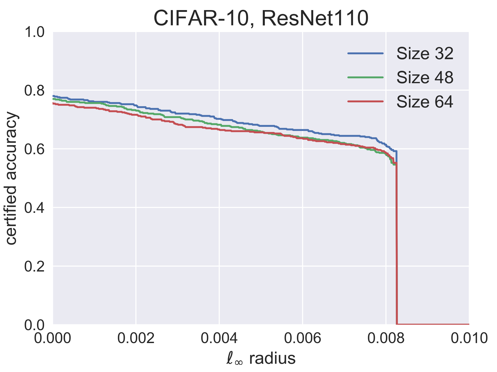

# TRADES-random-smoothing

This is the code for [the paper](https://arxiv.org/abs/2002.03517) "Random Smoothing Might be Unable to Certify  Robustness for High-Dimensional Images" by Avrim Blum (TTIC), Travis Dick (U. of Pennsylvania), Naren Manoj (TTIC), and Hongyang Zhang (TTIC).

TRADES + Random Smoothing achieves SOTA certified robustness in  norm at radius 2/255.

## Prerequisites
* Python (3.6.4)
* Pytorch (0.4.1)
* CUDA
* numpy

## Install
We suggest to install the dependencies using Anaconda or Miniconda. Here is an exemplary command:
```
$ wget https://repo.anaconda.com/archive/Anaconda3-5.1.0-Linux-x86_64.sh
$ bash Anaconda3-5.1.0-Linux-x86_64.sh
$ source ~/.bashrc
$ conda install pytorch=0.4.1
```
## TRADES+random smooth: A New Training Method for Certifiable Robustness

We used [TRADES](https://github.com/yaodongyu/TRADES) [[paper]](https://arxiv.org/pdf/1901.08573.pdf) to train a soft-random-smoothing classifier by injecting Gaussian noise. The method minimizes empirical risk of a regularized surrogate loss L(.,.) (e.g., the cross-entropy loss) with Gaussian noise:
}\left[\mathcal{L}(f(X+\eta),Y)+\beta\max_{X'\in\mathbb{B}_2(X,\epsilon)}\mathcal{L}(f(X+\eta),f(X'+\eta))\right].)

## Running Demos

### Certified  robustness at radius 2/255:

* Train ResNet-110 model on CIFAR10:
```bash
  $ python code/train_trades.py --epsilon 0.435 --imagesize 32 --noise_sd 0.12 --model-dir 'checkpoints/model_noise12_size32_l2trades0435_beta6_dir'
```

* Certify ResNet-110 model on CIFAR10:
```bash
  $ python code/certify_trades.py cifar10 --imagesize 32 --sigma 0.12 --outfile 'results/output_noise12_size32_l2trades0435_beta6_full' --skip 1 --batch 10000 --load-dir 'checkpoints/model_noise12_size32_l2trades0435_beta6/model-res110-epoch.pt'
```

* Benchmark:

| Method              	| Robust Accuracy  	| Natural Accuracy |
|-----------------------|-----------------------|------------------|
| TRADES + Random Smoothing   		|  62.6%   	|   78.7%    		|
| Salman et al. (2019)   		|  60.8%   	|   82.1%    		|
| Zhang et al. (2020)   		|  54.0%   	|   72.0%    		|
| Wong et al. (2018)   		|  53.9%   	|   68.3%    		|
| Mirman et al. (2018)   		|  52.2%   	|   62.0%    		|
| Gowal et al. (2018)   		|  50.0%   	|   70.2%    		|
| Xiao et al. (2019)   		|  45.9%   	|   61.1%    		|


### Effectiveness of lower bound:
* Train ResNet-110 models of varying input sizes (32, 48, 64) on CIFAR10:
```bash
  $ python code/train_trades.py --epsilon 0.435 --imagesize 32 --noise_sd 0.12 --model-dir 'checkpoints/model_noise12_size32_l2trades0435_beta6_dir'
  $ python code/train_trades.py --epsilon 0.6525 --imagesize 48 --noise_sd 0.18 --model-dir 'checkpoints/model_noise18_size48_l2trades06525_beta6_dir'
  $ python code/train_trades.py --epsilon 0.87 --imagesize 64 --noise_sd 0.24 --model-dir 'checkpoints/model_noise24_size64_l2trades087_beta6_dir'
```

* Certify ResNet-110 models of varying input sizes on CIFAR10:
```bash
  $ python code/certify_trades.py cifar10 --imagesize 32 --sigma 0.12 --outfile 'results/output_noise12_size32_l2trades0435_beta6' --skip 20 --batch 10000 --load-dir 'checkpoints/model_noise12_size32_l2trades0435_beta6_dir/model-res110-epoch.pt'
  $ python code/certify_trades.py cifar10 --imagesize 48 --sigma 0.18 --outfile 'results/output_noise18_size48_l2trades06525_beta6' --skip 20 --batch 10000 --load-dir 'checkpoints/model_noise18_size48_l2trades06525_beta6_dir/model-res110-epoch.pt'
  $ python code/certify_trades.py cifar10 --imagesize 64 --sigma 0.24 --outfile 'results/output_noise24_size64_l2trades087_beta6' --skip 20 --batch 10000 --load-dir 'checkpoints/model_noise24_size64_l2trades087_beta6_dir/model-res110-epoch.pt'
```

* Analyze results:
```bash
  $ python code/analyze.py 
```

<p align="center">
    
</p>
<p align="center">
  
It shows that the three curves of varying input sizes behave similarly. This empirically supports that the certified  robust radius ε should be proportional to the quantity . 

## Reference
For technical details and full experimental results, please check [the paper](https://arxiv.org/abs/2002.03517).
```
@article{Blum2020random, 
	author = {Avrim Blum and Travis Dick and Naren Manoj and Hongyang Zhang}, 
	title = {Random Smoothing Might be Unable to Certify $\ell_\infty$ Robustness for High-Dimensional Images}, 
	journal = {arXiv preprint arXiv:2002.03517},
	year = {2020}
}
```

## Contact
Please contact hongyanz@ttic.edu if you have any question on the codes. Enjoy!
